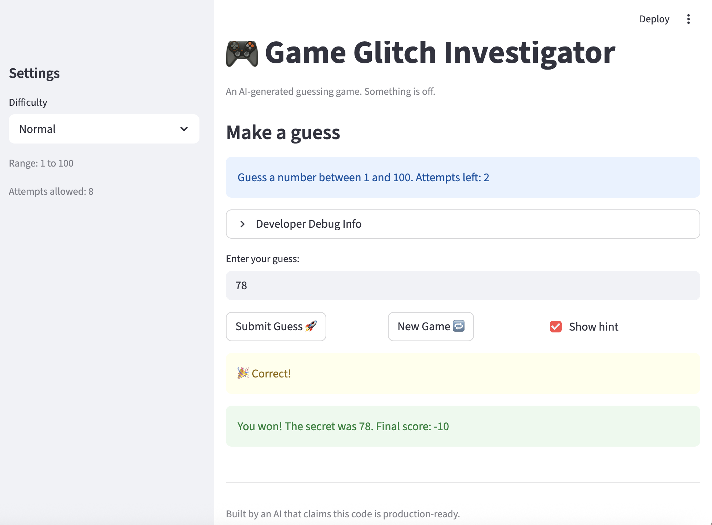

# 🎮 Game Glitch Investigator: The Impossible Guesser

## 🚨 The Situation

You asked an AI to build a simple "Number Guessing Game" using Streamlit.
It wrote the code, ran away, and now the game is unplayable. 

- You can't win.
- The hints lie to you.
- The secret number seems to have commitment issues.

## 🛠️ Setup

1. Install dependencies: `pip install -r requirements.txt`
2. Run the fixed app: `python -m streamlit run app.py`

## 🕵️‍♂️ Your Mission

1. **Play the game.** Open the "Developer Debug Info" tab in the app to see the secret number. Try to win.
2. **Find the State Bug.** Why does the secret number change every time you click "Submit"? Ask ChatGPT: *"How do I keep a variable from resetting in Streamlit when I click a button?"*
3. **Fix the Logic.** The hints ("Higher/Lower") are wrong. Fix them.
4. **Refactor & Test.** - Move the logic into `logic_utils.py`.
   - Run `pytest` in your terminal.
   - Keep fixing until all tests pass!

## 📝 Document Your Experience

**Game purpose:** A number guessing game where the player tries to guess a secret number within a limited number of attempts. The game gives hints after each guess and tracks a score.

**Bugs found:**

1. **Flipped hints** — `check_guess` returned "Go HIGHER" when the guess was too high and "Go LOWER" when it was too low. The comparison operators were correct but the messages were swapped.

2. **Silent string comparison** — On every even-numbered attempt, the code cast `secret` to a string before comparing. Python then did lexicographic comparison, so "9" > "10" and the feedback was silently wrong with no error or crash.

3. **Hardcoded range in UI** — The info banner always said "Guess a number between 1 and 100" regardless of difficulty. Hard mode uses 1–50 and Easy uses 1–20, so the banner was misleading.

4. **New game ignored difficulty** — The "New Game" button called `random.randint(1, 100)` instead of using `low`/`high` from the selected difficulty.

5. **Attempt counter off by one** — `attempts` was initialized to `1`, so players got one fewer guess than the displayed limit.

**Fixes applied:**

- Swapped the hint messages in `check_guess` so Too High -> "Go LOWER" and Too Low -> "Go HIGHER"
- Removed the even/odd `str(secret)` casting entirely; `secret` is always passed as an int
- Updated `st.info` to use `{low}` and `{high}` variables
- Updated the new game button to use `random.randint(low, high)` and reset `score`, `status`, and `history`
- Changed `attempts` initialization from `1` to `0`
- Refactored `get_range_for_difficulty`, `parse_guess`, `check_guess`, and `update_score` into `logic_utils.py`

## 📸 Demo

- 

## 🚀 Stretch Features

- [ ] [If you choose to complete Challenge 4, insert a screenshot of your Enhanced Game UI here]